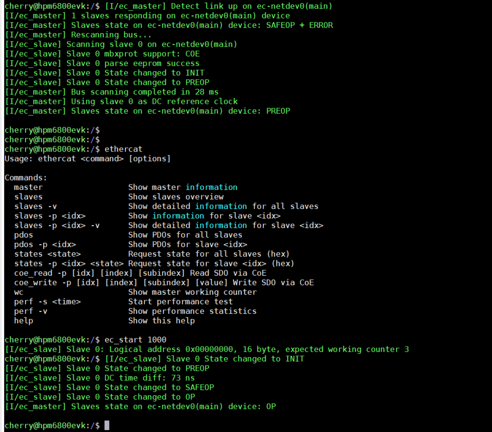
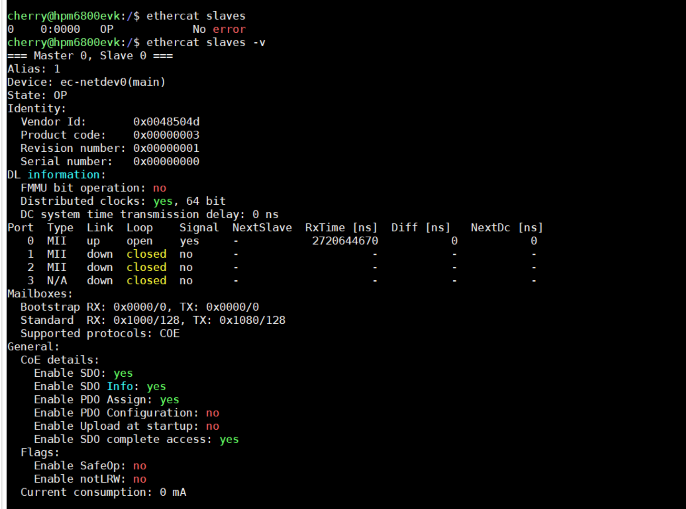
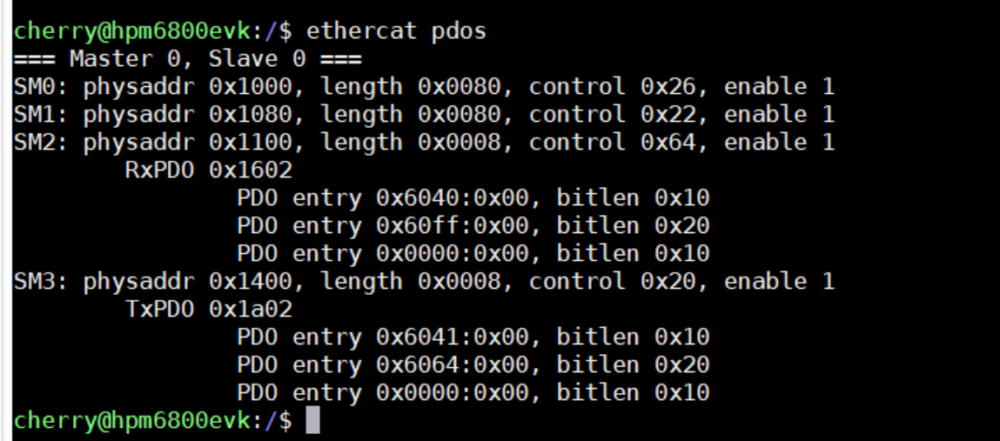
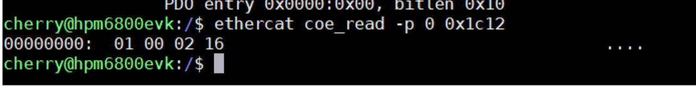
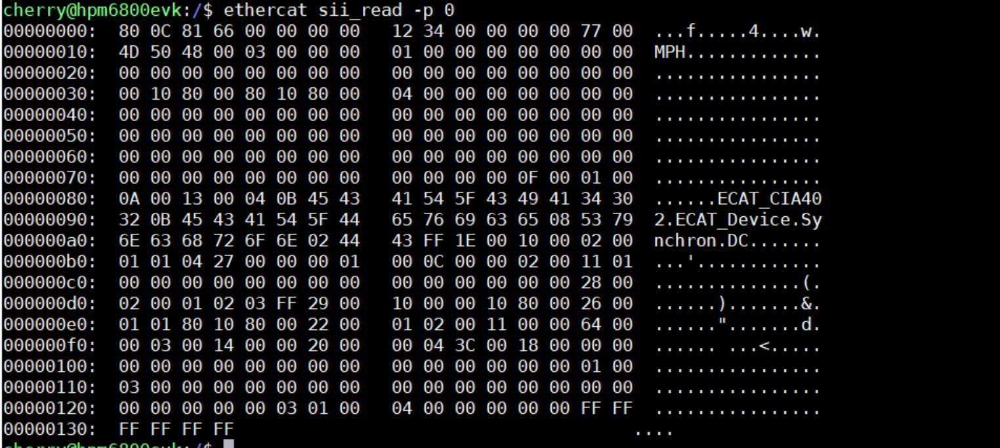

**English | [简体中文](README_zh.md)**

<h1 align="center" style="margin: 30px 0 30px; font-weight: bold;">CherryECAT</h1>

	
	

CherryECAT is a tiny and beautiful, high real-time and low-jitter EtherCAT master stack, specially designed for MCUs running with RTOS.

## Feature

- ~ 4K ram, ~32K flash(24K + 8K shell cmd + debug log)
- Asynchronous queue-based transfer (one transfer can carry multiple datagrams)
- Support hot-plugging
	- Automatic scanning bus
	- Automatic updating slave information when the topology changes
- Support automatic monitoring slave status
- Support distributed clocks
- Support CANopen over EtherCAT(COE)
- Support File over EtherCAT(FOE)
- Support Ethernet over EtherCAT(EOE)
- Support Slave SII access
- Support Slave register access
- Support multi master
- Support backup redundancy
- Minimum PDO cyclic time < 40 us (depends on master and slave hardware)
- Support ethercat cmd with shell, ref to IgH

## Hardware limitations

- **Master**
	- CPU (cache > 16K, memcpy speed > 100MB/s)
	- ENET must support descriptor dma and iperf with lwip > 90 Mbps
	- Code must run in ram, ignore if no dc
	- Must support High-Precision Timer (jitter < 1us)
	- Must support High-Precision timestamp (like ARM DWT)
	- Must support long long print

- **Slave**
	- Must support COE
	- Must support sdo complete access
	- SII must have sync manager information

## Shell cmd

## Support Boards

- HPM6750EVK2/HPM6800EVK/**HPM5E00EVK**(hybrid internal)

## Contact

QQ group: 563650597

## License

FOE,EOE and Backup redundancy features are available for commercial charge; other are free to use